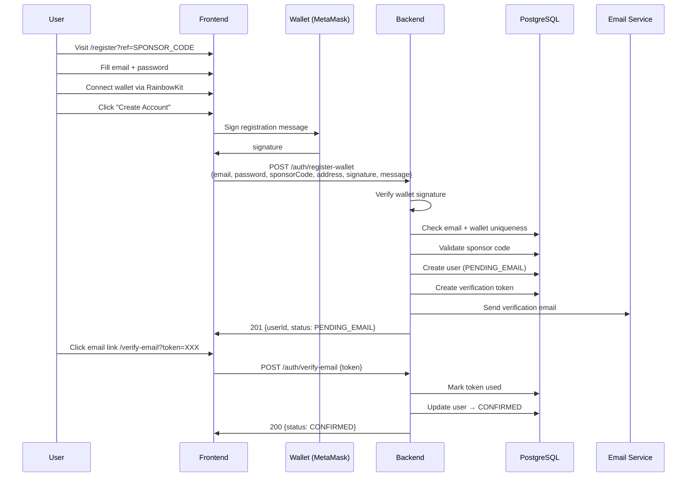
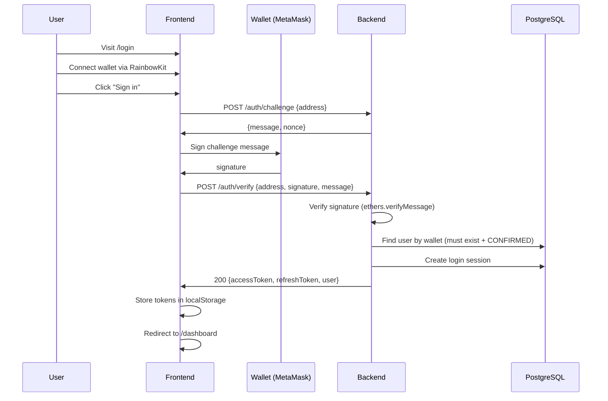
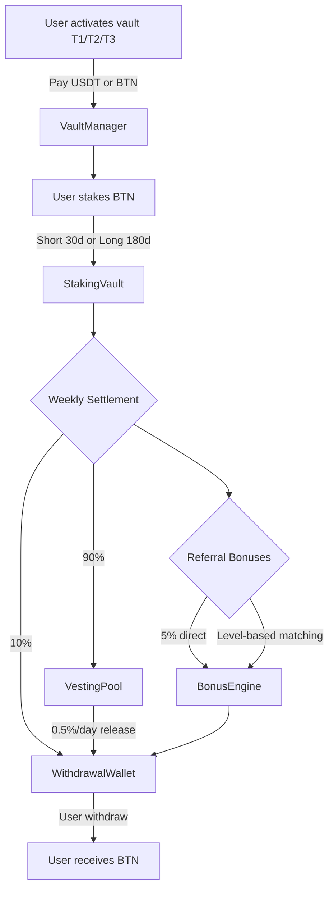
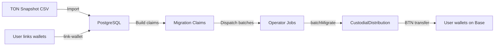
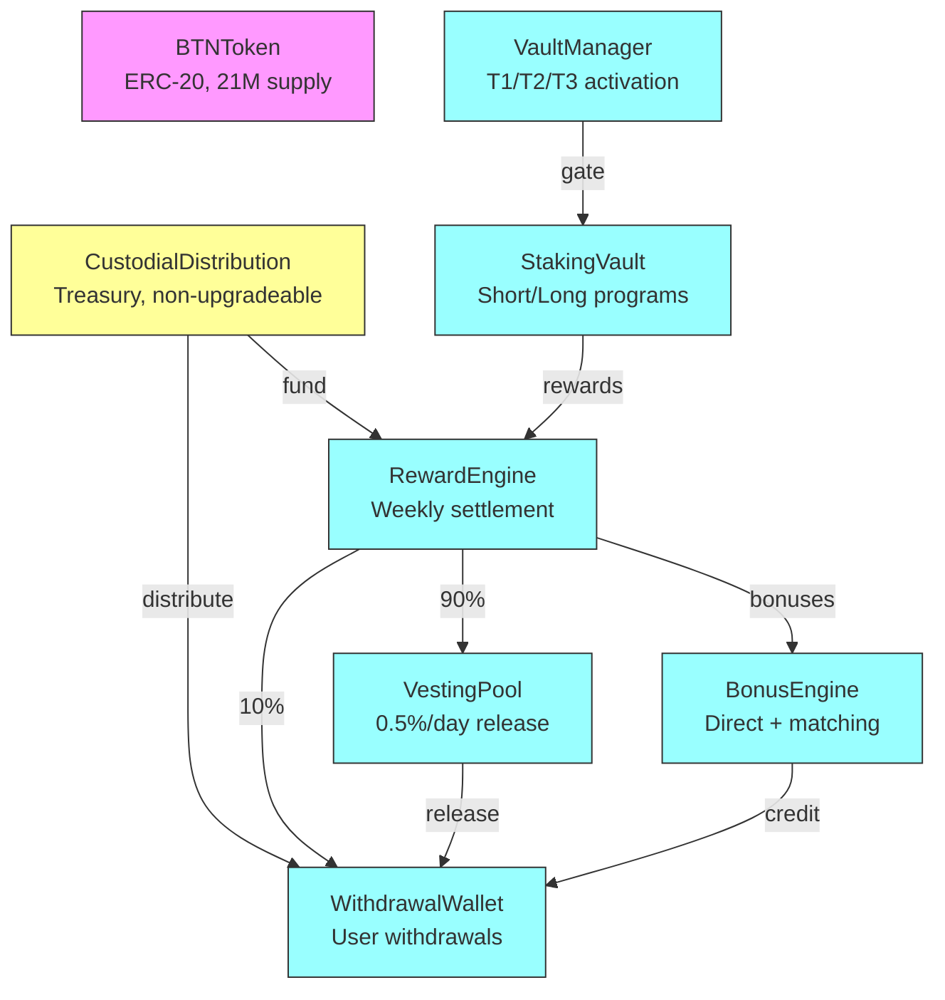
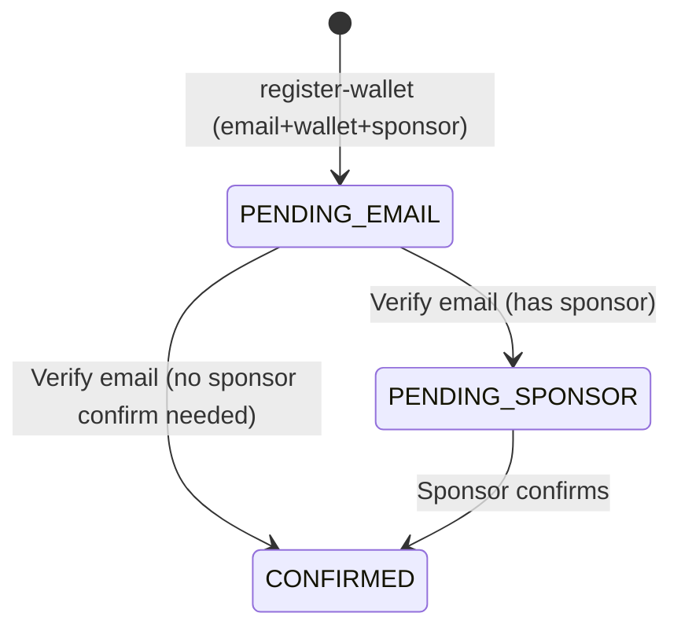

# BitTON.AI — System Diagrams

## 1. User Registration Flow (Email + Wallet + Sponsor)



## 2. Wallet Login Flow (Challenge-Sign)



## 3. Staking & Reward Lifecycle



## 4. TON → Base Migration Pipeline



## 5. Contract Architecture



## 6. User Status State Machine



## Exporting to PNG

Use `scripts/export-diagrams.sh` to render these diagrams as PNG:

```bash
chmod +x scripts/export-diagrams.sh
./scripts/export-diagrams.sh
# Output: docs/images/*.png
```
